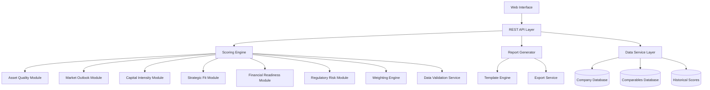

# Design Document

## Overview

The BD & IPO Scoring Module is designed as a modular, data-driven system that evaluates biotech companies across multiple dimensions to generate actionable investment insights. The system follows a layered architecture with clear separation between data ingestion, scoring logic, valuation modeling, and reporting components.

The core design philosophy emphasizes:
- **Modularity**: Each scoring pillar is implemented as an independent module
- **Configurability**: Weights and criteria can be customized without code changes
- **Auditability**: All scoring decisions are traceable and explainable
- **Scalability**: System can handle multiple concurrent evaluations
- **Data Integrity**: Robust validation and error handling throughout

## Architecture

### High-Level Architecture



### System Layers

1. **Presentation Layer**: Web-based interface for data input and report viewing
2. **API Layer**: RESTful services for all system operations
3. **Business Logic Layer**: Core scoring algorithms and business rules
4. **Data Access Layer**: Database operations and external data integration
5. **Infrastructure Layer**: Configuration, logging, and system utilities

## Components and Interfaces

### Core Components

#### 1. Scoring Engine
**Purpose**: Orchestrates the evaluation process across all scoring pillars

**Key Interfaces**:
```typescript
interface ScoringEngine {
  evaluateCompany(companyData: CompanyData, config: ScoringConfig): Promise<ScoringResult>
  validateInputData(data: CompanyData): ValidationResult
  calculateWeightedScore(pillarScores: PillarScores, weights: WeightConfig): WeightedScore
}

interface ScoringResult {
  companyId: string
  overallScore: number
  pillarScores: PillarScores
  weightedScores: WeightedScores
  confidence: ConfidenceMetrics
  recommendations: string[]
  timestamp: Date
}
```

#### 2. Pillar Scoring Modules
Each pillar implements a common interface for consistency:

```typescript
interface ScoringPillar {
  calculateScore(data: CompanyData, context: MarketContext): PillarScore
  getRequiredFields(): string[]
  validateData(data: any): ValidationResult
  explainScore(score: PillarScore): ScoreExplanation
}

interface PillarScore {
  rawScore: number // 1-5 scale
  confidence: number // 0-1 scale
  factors: ScoringFactor[]
  warnings: string[]
}
```

**Asset Quality Module**:
- Evaluates pipeline strength, development stage, competitive positioning
- Considers indication size, unmet medical need, differentiation
- Assesses intellectual property strength and freedom to operate

**Market Outlook Module**:
- Analyzes addressable market size and growth potential
- Evaluates competitive landscape and market dynamics
- Considers regulatory pathway and reimbursement environment

**Capital Intensity Module**:
- Assesses development costs and capital requirements
- Evaluates manufacturing complexity and scalability
- Considers regulatory and clinical trial costs

**Strategic Fit Module**:
- Analyzes alignment with acquirer capabilities and strategy
- Evaluates synergy potential and integration complexity
- Considers geographic and therapeutic area fit

**Financial Readiness Module**:
- Analyzes current cash position and burn rate
- Calculates funding runway and financing needs
- Evaluates financial management and governance

**Regulatory Risk Module**:
- Assesses regulatory pathway complexity and timeline
- Evaluates clinical trial risks and regulatory precedents
- Considers safety profile and manufacturing risks

#### 3. Valuation Engine
**Purpose**: Generates valuation estimates based on comparable transactions

```typescript
interface ValuationEngine {
  calculateValuation(companyData: CompanyData, comparables: Comparable[]): ValuationResult
  findComparables(criteria: ComparableCriteria): Comparable[]
  generateScenarios(baseValuation: number): ValuationScenario[]
}

interface ValuationResult {
  baseValuation: number
  scenarios: ValuationScenario[]
  comparables: Comparable[]
  methodology: string
  confidence: number
}
```

#### 4. Report Generator
**Purpose**: Creates comprehensive reports with visualizations and insights

```typescript
interface ReportGenerator {
  generateExecutiveSummary(result: ScoringResult): ExecutiveSummary
  createDetailedReport(result: ScoringResult, template: ReportTemplate): Report
  exportReport(report: Report, format: ExportFormat): Buffer
}
```

### Data Models

#### Core Data Structures

```typescript
interface CompanyData {
  basicInfo: {
    name: string
    ticker?: string
    sector: string
    therapeuticAreas: string[]
    stage: DevelopmentStage
  }
  
  pipeline: {
    programs: Program[]
    totalPrograms: number
    leadProgram: Program
  }
  
  financials: {
    cashPosition: number
    burnRate: number
    lastFunding: FundingRound
    runway: number // months
  }
  
  market: {
    addressableMarket: number
    competitors: Competitor[]
    marketDynamics: MarketDynamics
  }
  
  regulatory: {
    approvals: Approval[]
    clinicalTrials: ClinicalTrial[]
    regulatoryStrategy: RegulatoryStrategy
  }
}

interface Program {
  name: string
  indication: string
  stage: DevelopmentStage
  mechanism: string
  differentiators: string[]
  risks: Risk[]
  timeline: Milestone[]
}

interface WeightConfig {
  assetQuality: number
  marketOutlook: number
  capitalIntensity: number
  strategicFit: number
  financialReadiness: number
  regulatoryRisk: number
}
```

## Error Handling

### Error Categories

1. **Data Validation Errors**: Missing or invalid input data
2. **Calculation Errors**: Issues in scoring algorithms or mathematical operations
3. **External Data Errors**: Problems accessing comparable data or market information
4. **System Errors**: Infrastructure or configuration issues

### Error Handling Strategy

```typescript
interface ErrorHandler {
  handleValidationError(error: ValidationError): ErrorResponse
  handleCalculationError(error: CalculationError): ErrorResponse
  handleDataAccessError(error: DataAccessError): ErrorResponse
  logError(error: Error, context: ErrorContext): void
}

interface ErrorResponse {
  success: false
  errorCode: string
  message: string
  details?: any
  suggestions?: string[]
}
```

### Graceful Degradation

- **Partial Data**: System continues with available data, flagging missing components
- **External Service Failures**: Falls back to cached data or simplified calculations
- **Calculation Errors**: Provides best-effort scores with confidence adjustments

## Testing Strategy

### Testing Pyramid

#### 1. Unit Tests
- Individual pillar scoring logic
- Data validation functions
- Mathematical calculations
- Utility functions

#### 2. Integration Tests
- End-to-end scoring workflows
- Database operations
- External API integrations
- Report generation

#### 3. System Tests
- Complete user scenarios
- Performance under load
- Data consistency checks
- Security validation

### Test Data Strategy

#### Reference Companies
- Create a suite of reference biotech companies with known characteristics
- Include edge cases and boundary conditions
- Maintain expected scoring outcomes for regression testing

#### Synthetic Data
- Generate realistic but synthetic company data for testing
- Ensure data privacy and confidentiality
- Cover full range of company types and stages

### Performance Testing

#### Load Testing
- Concurrent scoring requests
- Large dataset processing
- Report generation under load

#### Accuracy Testing
- Compare predictions to actual outcomes
- Track scoring accuracy over time
- Validate comparable selection algorithms

### Validation Framework

```typescript
interface ValidationFramework {
  validateScoring(company: CompanyData, expectedRange: ScoreRange): ValidationResult
  validateComparables(company: CompanyData, comparables: Comparable[]): ValidationResult
  validateReports(report: Report, requirements: ReportRequirements): ValidationResult
}
```

## Security and Compliance

### Data Security
- Encryption at rest and in transit
- Role-based access controls
- Audit logging for all operations
- Data anonymization for testing

### Compliance Considerations
- Financial data handling regulations
- Intellectual property protection
- Export control compliance for international data

## Performance Requirements

### Response Times
- Individual company scoring: < 5 seconds
- Batch processing: < 30 seconds per company
- Report generation: < 10 seconds
- Comparable search: < 2 seconds

### Scalability
- Support 100+ concurrent users
- Process 1000+ companies in batch mode
- Store 10+ years of historical data
- Handle 50+ custom weighting configurations